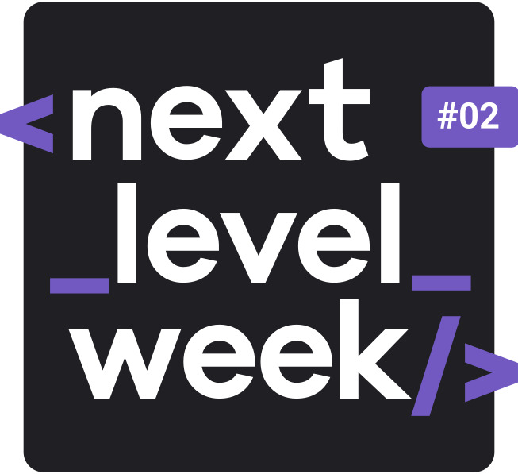
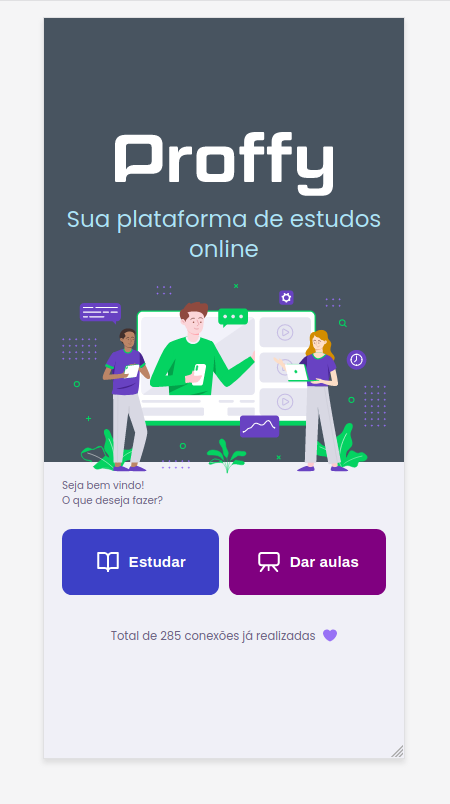
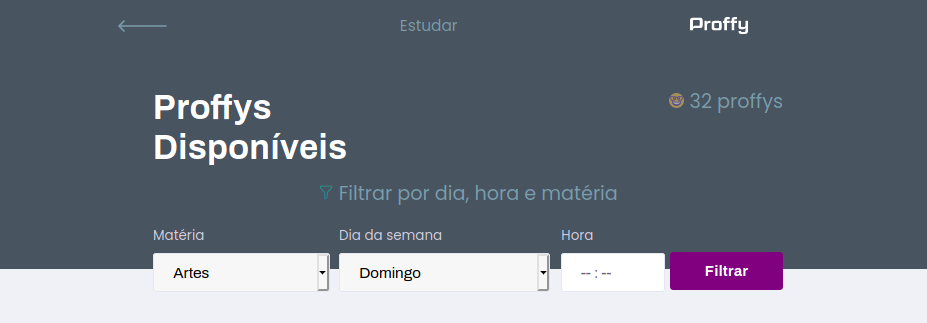
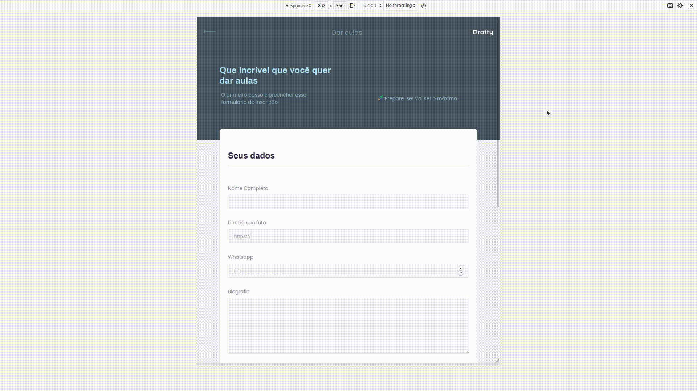
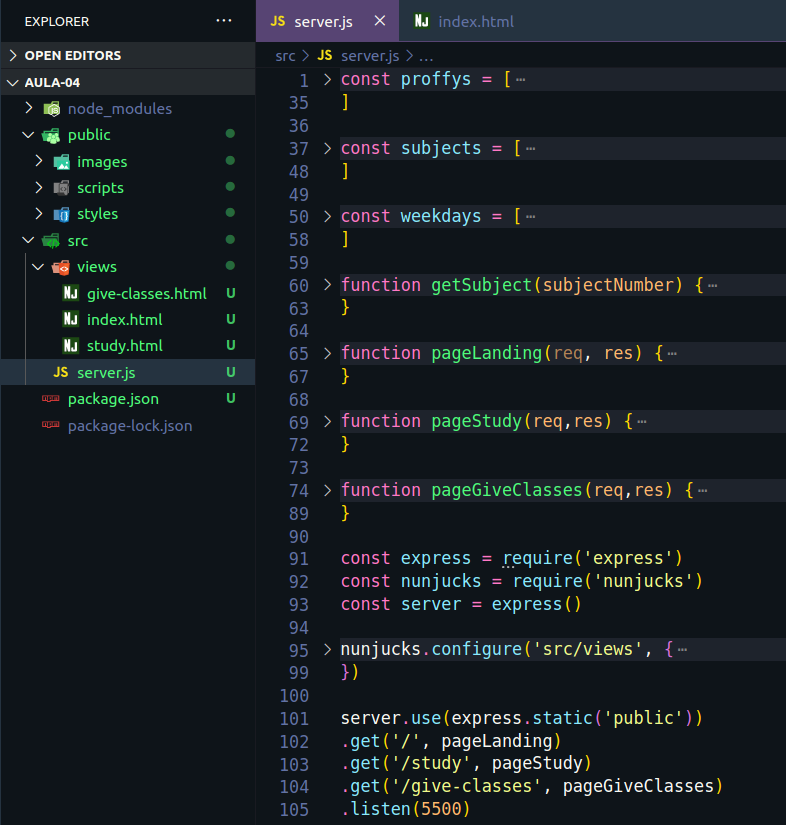

<h1 align="center">
    
</h1>

<h1 align="center">
  TRILHA DISCOVERY
</h1>

## Índice

- [Sobre](#sobre)
- [Dia 01](#dia-01)
- [Dia 02](#dia-02)
- [Dia 03](#dia-03)
- [Dia 04](#dia-04)
- [Dia 05](#dia-05)
- [Dia 06](#dia-06)
- Dia 07

 ---
 
## Sobre

**Next Level Week** é um evento online produzido pela **Rocketseat** que visa desenvolver uma aplicação do início ao fim em 5 dias, utilizandos dos princiapis fundamentos do desenvolvimento até conceitos avançados e tecnologias modernas, sendo a Trilha Discovery destinada aos dev's iniciantes.

Este repositório visa acompanhar o meu progresso e será separado por Dia, onde eu listo o que foi desenvolvido.

---

## Dia 01

<h2>Aula 01</h2>
<h3 align="center">
    
</h3>

<h3 align="center">Desenvoler a página inicial do projeto.</h3>

Na primeira dia foi desenvolvido o layout da primeira página utilizando HTML e CSS.

Foram disponibilizadas as imagens e paleta de cores... mas eu resolvi dar o meu toque nela.

---

## Dia 02

<h3 align="center">
    
</h3>

<h3 align="center">Finalização da página inicial</h3>

Foi realizada a refatoração do código, a separação em pastas e ajustada a responsividade, tornando a aplicação pronta tanto para web quanto para mobile.

---

## Dia 03

<h2>Aula 02</h2>
<h3 align="center">
    
</h3>

<h3 align="center">Criação e estilização do header da página de busca de proffys</h3>

---

## Dia 04

<h3 align="center">
    
</h3>

<h3 align="center">Estilização dos cards da página de busca de proffys</h3>

---

## Dia 05

<h3 align="center">
    
</h3>

<h3 align="center">Finalização da página de busca de proffys</h3>

---

## Dia 06

<h2>Aula 03</h2> 
<h3 align="center">
   
</h3>

<h3 align="center">Criação e estilização da página de cadastro para proffys</h3>

<h4>

Nesta aula foram desenvolvidos os primeiros conceitos de Javascript para adicionar novos horários na grade de horários disponíveis.

</h4>

---

<h2>Aula 04</h2> 
<h3 align="center">
   
</h3>

<h4>
Nesta aula foi desenvolvido o back-end da aplicação, com a inicialização do servidor, criação das rotas e configuração da inserção de dados.
</h4>

---

Desenvolvido 💖 por Nádia Ligia

